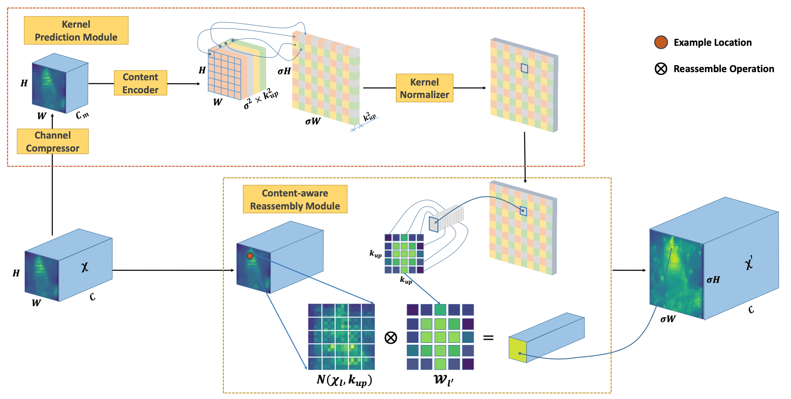

# CARAFE
A PyTorch implementation of CARAFE based on ICCV 2019 paper [CARAFE: Content-Aware ReAssembly of FEatures](https://arxiv.org/abs/1905.02188).



## Requirements
* [Anaconda](https://www.anaconda.com/download/)
* PyTorch
```
conda install pytorch torchvision -c pytorch
```

## Installation
```
pip install git+https://github.com/leftthomas/CARAFE.git@master
```
To update:
```
pip install --upgrade git+https://github.com/leftthomas/CARAFE.git@master
```

## Example
```python
from carafe.carafe import CARAFE, CARAFENaive
module = CARAFE(kernel_size=5, group_size=1, scale_factor=4)
module = CARAFENaive(kernel_size=5, group_size=1, scale_factor=4)
```

## Contribution
Any contributions to CARAFE are welcome!

## Copyright and License
CARAFE is provided under the [MIT License](LICENSE).
